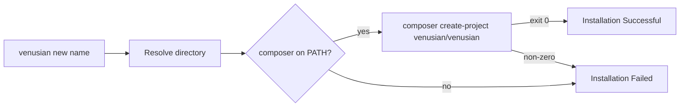

# Venusian Installer

<a href="https://github.com/VenusianPHP/installer/actions"></a>
<a href="https://packagist.org/packages/venusian/installer"></a>
<a href="https://packagist.org/packages/venusian/installer"></a>
<a href="https://packagist.org/packages/venusian/installer"></a>

## Introduction

The Venusian installer creates new [Venusian PHP](https://venusian.projectsaturnstudios.com) applications from the `venusian/venusian` skeleton.

## Requirements

- PHP 8.4, 8.5 or 8.6
- [Composer](https://getcomposer.org/download/) on your `PATH`

## Installation

```bash
composer global require venusian/installer
```

Make sure Composer's global `vendor/bin` directory is on your `PATH` so the `venusian` command is available.

## Usage

```bash
venusian new example-app
```

`name` may be a directory name (created under the current directory), `.` for the current directory, or an absolute path. The installer finds `composer` and runs:

```bash
composer create-project venusian/venusian:^0.10.0 <directory> --remove-vcs --prefer-dist
```

The skeleton's Composer hooks then copy `.env.example` to `.env`, write an `APP_KEY`, create `database/database.sqlite`, and discover packages. Run your first sketch:

```bash
cd example-app
php rocket hello-world
```



### Updates

On each interactive run the installer checks Packagist, at most once a day, for a newer `venusian/installer`. When one exists it offers to run `composer global require` for it and re-runs your command on the new version. Non-interactive runs skip the check; to skip it in an interactive shell:

```bash
VENUSIAN_INSTALLER_NO_UPDATE_CHECK=1 venusian new example-app
```

## Official Documentation

Documentation for installing Venusian can be found on the [Venusian website](https://venusian.projectsaturnstudios.com/docs#creating-a-venusian-php-project).

## Contributing

Thank you for considering contributing to the Installer! The contribution guide can be found in the [Venusian documentation](https://venusian.projectsaturnstudios.com/docs/contributions).

## Code of Conduct

In order to ensure that the Venusian community is welcoming to all, please review and abide by the [Code of Conduct](https://venusian.projectsaturnstudios.com/docs/contributions#code-of-conduct).

## Security Vulnerabilities

Please review [our security policy](SECURITY.md) on how to report security vulnerabilities.

## License

Venusian Installer is open-sourced software licensed under the [MIT license](LICENSE).
