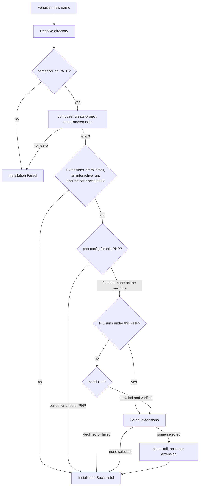

# Venusian Installer

<a href="https://github.com/VenusianPHP/installer/actions"></a>
<a href="https://packagist.org/packages/venusian/installer"></a>
<a href="https://packagist.org/packages/venusian/installer"></a>
<a href="https://packagist.org/packages/venusian/installer"></a>

## Introduction

The Venusian installer creates new [Venusian PHP](https://venusian.projectsaturnstudios.com) applications from the `venusian/venusian` skeleton.

## Requirements

- PHP 8.4, 8.5 or 8.6
- [Composer](https://getcomposer.org/download/) on your `PATH`
- For the optional PHP extensions: a C compiler and your PHP's development files (`phpize`, `php-config`). [PIE](https://github.com/php/pie) does the building; the installer offers to install it when it is missing.

## Installation

```bash
composer global require venusian/installer
```

Make sure Composer's global `vendor/bin` directory is on your `PATH` so the `venusian` command is available.

## Usage

```bash
venusian new example-app
```

`name` may be a directory name (created under the current directory), `.` for the current directory, or an absolute path. The installer finds `composer` and runs:

```bash
composer create-project venusian/venusian:^0.10.0 <directory> --remove-vcs --prefer-dist
```

The skeleton's Composer hooks then copy `.env.example` to `.env`, write an `APP_KEY`, create `database/database.sqlite`, and discover packages. Run your first sketch:

```bash
cd example-app
php rocket hello-world
```

### PHP extensions

Once the application exists, an interactive run offers Venusian's first-party PHP extensions:

| Extension | What it gives the framework | Offered on |
|---|---|---|
| [epoll](https://packagist.org/packages/php-io-extensions/epoll) | event loop waiting on Linux | Linux |
| [kqueue](https://packagist.org/packages/php-io-extensions/kqueue) | event loop waiting on macOS | macOS |
| [pcurl](https://packagist.org/packages/php-io-extensions/pcurl) | HTTP requests that run on the event loop | everywhere but Windows |

The list shows all three. One that belongs to another operating system, or that your PHP already loads, is a disabled row with its reason:

```
 ┌ Extensions to install ───────────────────────────────────────┐
 │   – epoll — event loop waiting on Linux (Linux only)         │
 │ › ◼ kqueue — event loop waiting on macOS                     │
 │   ◼ pcurl — HTTP requests that run on the event loop         │
 └──────────────────────────────────────────────────────────────┘
```

Each selected extension is built and installed by [PIE](https://github.com/php/pie), run by the PHP binary that is running the installer, so the extensions land in that PHP:

```bash
php pie install php-io-extensions/kqueue:^0.10 --with-php-config=/path/to/that/php-config
```

- **PIE missing:** the installer asks before downloading `pie.phar` from the [PIE releases](https://github.com/php/pie/releases) to `~/.local/bin/pie`, then has PIE verify its own release attestation. A copy that fails is removed.
- **sudo:** PIE asks for your password itself when PHP's extension directory is not writable.
- **Failures:** a failed build is reported in the closing summary and does not undo the application. The framework runs without these extensions.
- Declining, or a non-interactive run, skips the step.



### Installing extensions later

`venusian install:ext` installs any of Venusian's first-party PHP extensions, at any time, into the PHP binary running `venusian`:

```bash
venusian install:ext          # choose from the list
venusian install:ext imgdec   # install that one
```

| Extension | What it is | Runs on |
|---|---|---|
| epoll | event loop waiting on Linux | Linux |
| kqueue | event loop waiting on macOS | macOS |
| pcurl | HTTP requests that run on the event loop | everywhere but Windows |
| appkit | native macOS windows and controls | macOS |
| gtk | GTK 4 windows and controls | Linux, macOS |
| qt | Qt 6 windows and controls | Linux, macOS |
| fb | framebuffers in C | Linux, macOS |
| rasterize | shape and text rasterising in C | Linux, macOS |
| imgdec | PNG, JPEG and TIFF decoding in C | Linux, macOS |
| posi | POSIX files, terminals and devices | everywhere but Windows |
| ftdi | FTDI USB adapters: GPIO, I2C, SPI, UART | everywhere but Windows |

The list shows every extension. A row is disabled, with its reason, when the extension belongs to another operating system, when your PHP already loads it, or when Packagist has neither a 0.10 release nor a 0.10 development branch of it. Nothing starts selected.

An extension with no tagged 0.10 release yet installs from its 0.10 development branch (`0.10.x-dev`); its row and its outcome say so.

PIE is found, or offered, exactly as in `venusian new`. Some extensions build against system libraries (GTK 4, Qt 6, libpng, libjpeg, libtiff, libftdi); PIE reports what is missing.

Without a terminal, name the extension: `venusian install:ext posi --no-interaction`. The command exits 0 when everything asked for is installed or there was nothing to install, and 1 otherwise.

### Build tooling

`venusian install:sdk` installs [`venusian/build`](https://github.com/VenusianPHP/build) globally through Composer. The installer picks up any installed package of Composer type `venusian-tool` and adds the commands it declares under `extra.venusian.commands`, so after `install:sdk` the installer has `build`:

```bash
venusian install:sdk
cd example-app
venusian build          # build/<Name>.app on macOS arm64
```

See venusian/build's README for the interview, `config/build.php` and what the bundle contains.

### Updates

On each interactive run the installer checks Packagist, at most once a day, for a newer `venusian/installer`. When one exists it offers to run `composer global require` for it and re-runs your command on the new version. Non-interactive runs skip the check; to skip it in an interactive shell:

```bash
VENUSIAN_INSTALLER_NO_UPDATE_CHECK=1 venusian new example-app
```

## Official Documentation

Documentation for installing Venusian can be found on the [Venusian website](https://venusian.projectsaturnstudios.com/docs#creating-a-venusian-php-project).

## Contributing

Thank you for considering contributing to the Installer! The contribution guide can be found in the [Venusian documentation](https://venusian.projectsaturnstudios.com/docs/contributions).

## Code of Conduct

In order to ensure that the Venusian community is welcoming to all, please review and abide by the [Code of Conduct](https://venusian.projectsaturnstudios.com/docs/contributions#code-of-conduct).

## Security Vulnerabilities

Please review [our security policy](SECURITY.md) on how to report security vulnerabilities.

## License

Venusian Installer is open-sourced software licensed under the [MIT license](LICENSE).
